# AWS BUILD SERVER CREATION

### LAUNCH EC2

create a instance by giving instance name

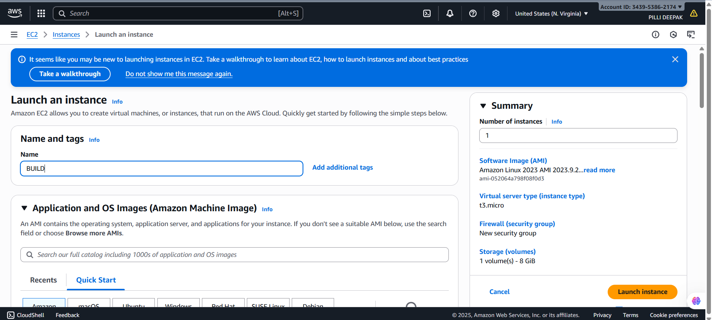

----

select ubuntu image and make sure it is latest version i.e 24.04 LTS (HVM)

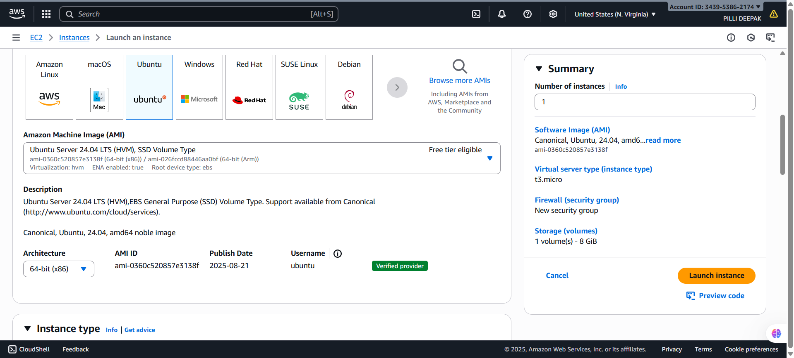

------

click on edit network settings and change security group name(optional) and launch instance

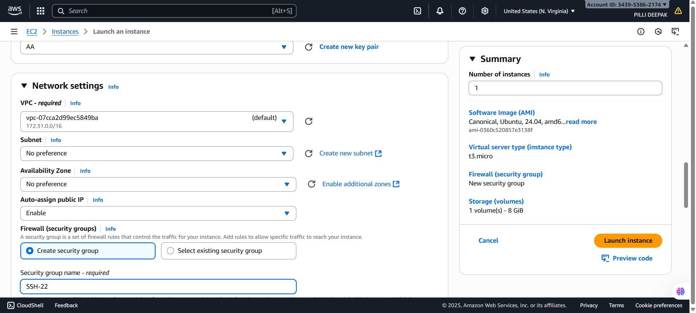

-----

connect to the instance

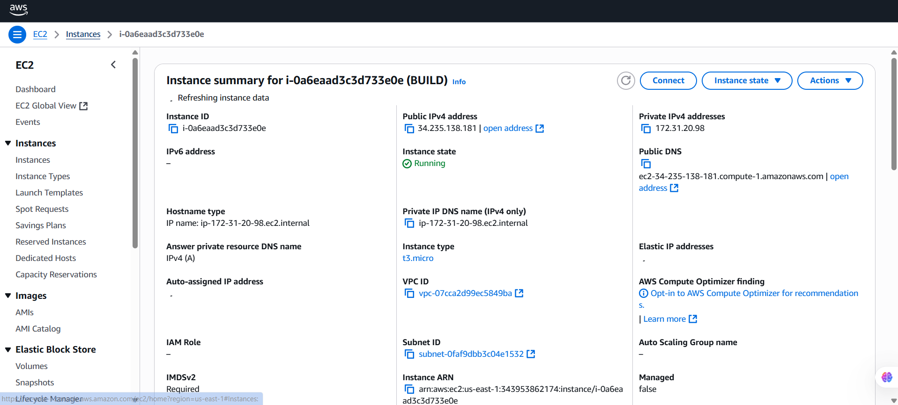

-----

copy the SSH key and open terminal

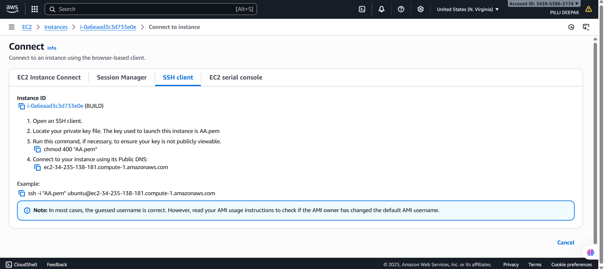

------

In terminal change directory to downloads(your PEM file is present in downloads) use the below command: `cd downloads` and press enter paste the SSH key and press enter now it will ask permission yes/no type yes

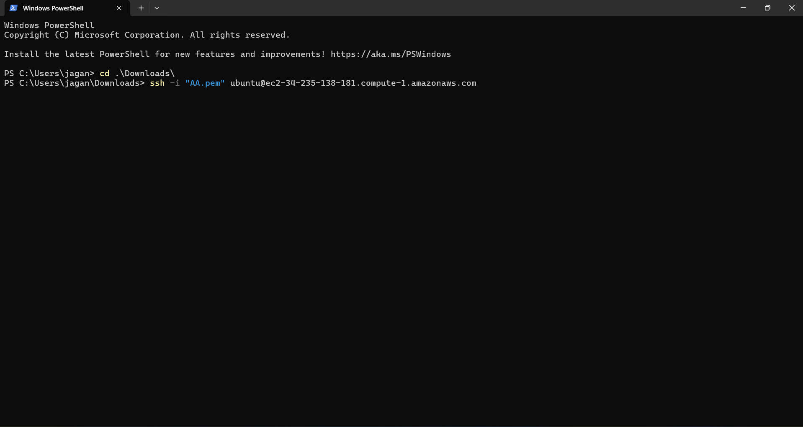

-----

Now you are connected to BUILD server image(ubuntu)

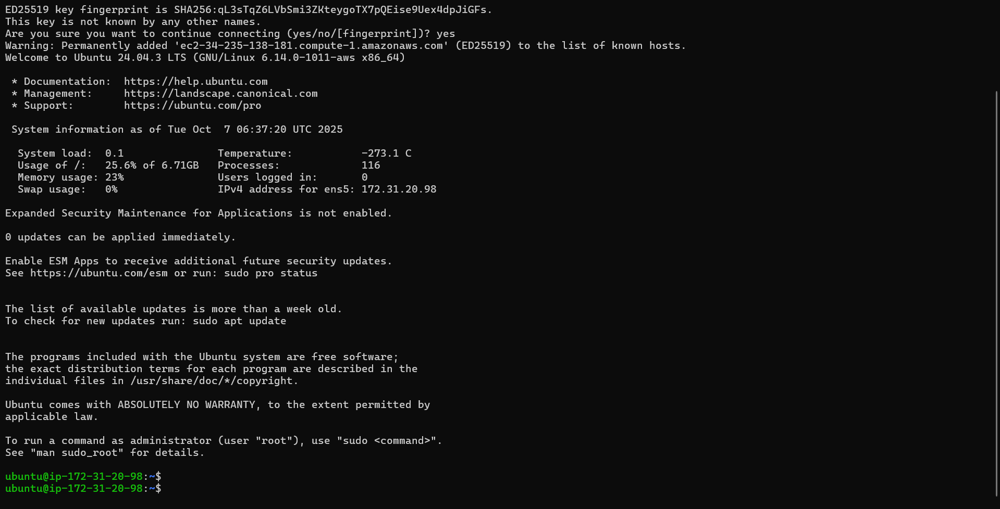

------

# JAVA BUILD-MAVEN VERSION 0.0.1

> we have full java code which is cloned from github using `git clone <URL>` now iam changing it to version 0.0.1 that has only addition feature 
>
> `cd src/main/webapp/`
>
> `sudo vi index.jsp`


------

> remove that highlighted part shown in below image


------

> after removing save the file and now this code becomes suitable to perform only addition function


------

> Now modify the pom.xml file i.e by changing the highlighted part version and artifact id name


-----

> Now the version is changed to 0.0.1 and also artifact id to webapp-add
>
> save it


----

> Now set up your environment to perform build
>
> update and install java first and also install maven `sudo apt install maven`
>
> validate using `mvn validate` and build using `mvn package`


-------

> after build you will now get a .war file of first version


----

# AWS DEPLOY SERVER CREATION AND CONFIGURATION

#### LAUNCH EC2

create an instance by giving instance name

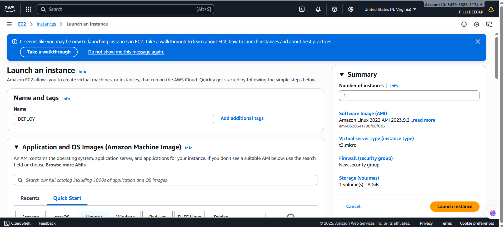

------

select image ubuntu latest version same as BUILD server and launch the server

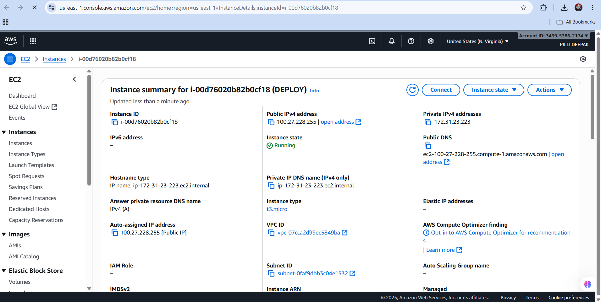

------

configure inbound rules go to security and u will find inbound and outbound rules

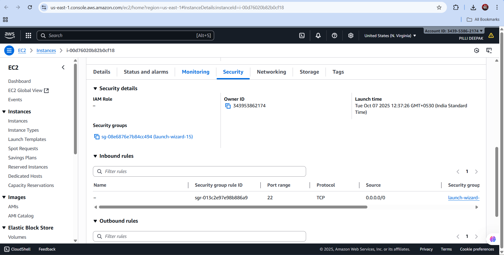

-----

select edit inbound rules to add port number of TOMCAT WEB Server

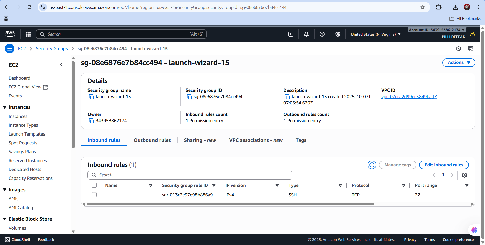

----

Add port number 8080

Type: custom TCP ; Port range: 8080 ; Source: Anywhere IPV4

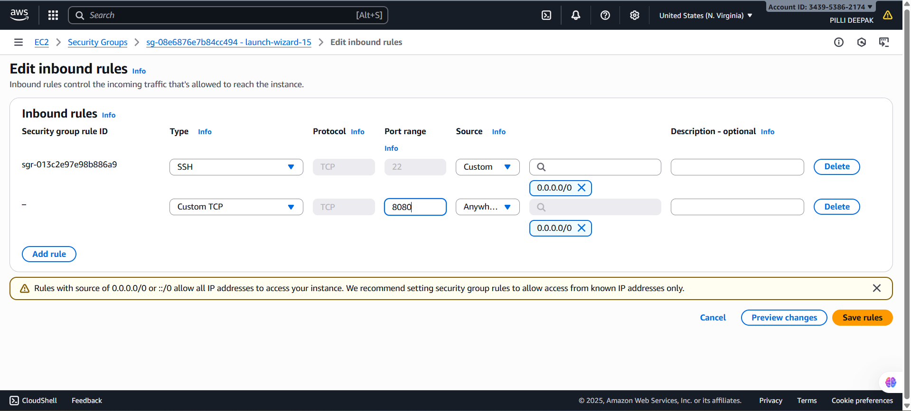

------

After adding inbound rule click save rules and it will show successfully modified

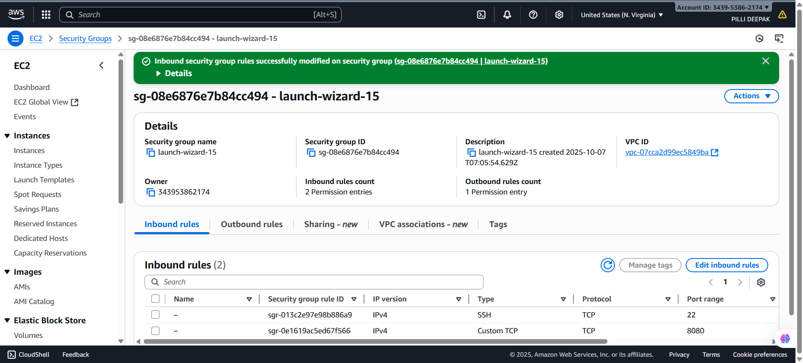

-----

copy the SSH key and open Terminal

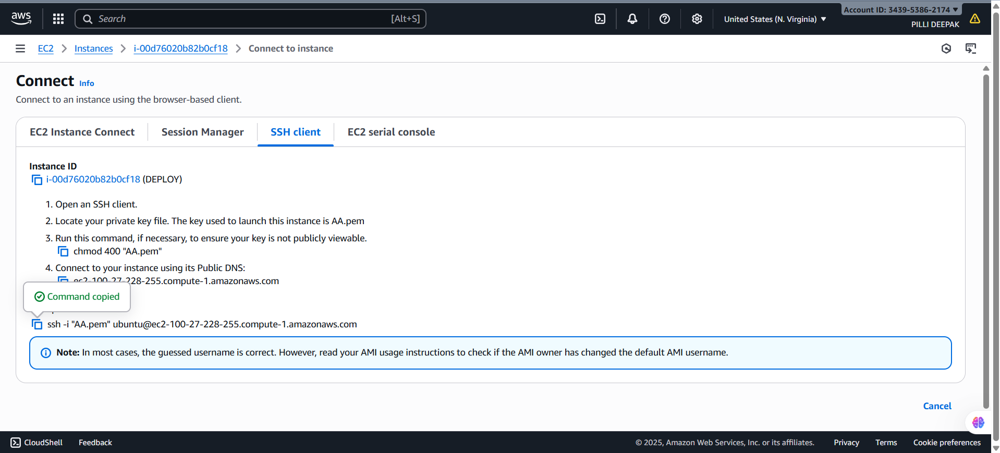

-----

Use `cd downloads` to get into PEM file location which is saved in downloads

Now paste the SSH key and enter yes you will be connected to DEPLOY server

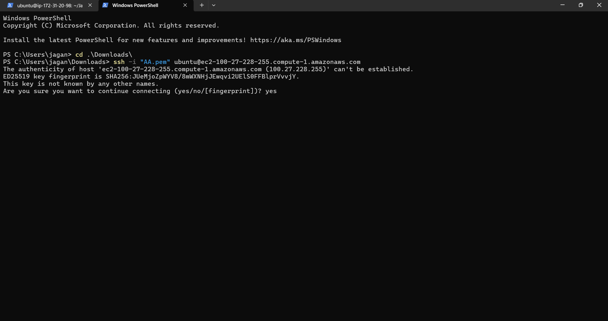

-----

# NEXUS TOOL SETUP

> similar to our DEPLOY server launch instance but add port number 8081 as nexus runs on port number 8081
>
> Download java (nexus needs java)


----

> download nexus from browser by copying link address


----

> copy the link address of linux as we are now using ubuntu


----

> Download using `wget <link address>` 
>
> `ls` you can see the tar file


------

> extract the file using `tar -xvf <zip file name>`


------

> after extracting cd `nexus-3.85.0-03` and `ls`
>
> you will see a executable nexus file
>
> run that executable file


-----

> it will execute and show usage 
>
> now start nexus using `./nexus start`


----

> you can see the status of nexus whether it started or not by using `netstat -ntpl` (highlighted part in image shows port number of nexus)


-----

> now copy the public ip of nexus server 


------

> New tab and paste the public ip along with port number of nexus i.e `54.92.192.98:8081`


------

> now the nexus tool is successfully installed and its running 


-----

> login and default username is admin
>
> configure password (copy the path )
>
> While installing and starting nexus it creates a default password and also it gives the path where the password is stored


-----

> now to read the password 
>
> `sudo cat <path>`


-----

> it will ask you to set up a password give any and click next


-----

> disable anonymous access


----

> You can see all the default repos created by nexus in browse


----

> create your own repo 
>
> go to system status 


-----

> click on repositories and you will see create a repository 


----

> by using that create a repository it will ask you to select the recipe type select maven(hosted)


-----

> Give a name to your repo and click on create


-----

> after creating you can see you repo in browse


-------

# DEPLOYMENT-TOMCAT WEB SERVER SETUP

Update the server using `sudo apt -y update`

Install JAVA latest version by using `sudo apt install openjdk-17-jre-headless -y`


-----

Browse apache tomcat install and open the website

copy the address(URL Link) of tar.gz(pgp,sha512) file


-----

Use `wget <tar.gz link address>` to download the folder

By using `ls` u can find downloaded folder


------

to extract the folder use `tar -xvf apache-tomcat-9.0.110.tar.gz`


------

Now change directory to bin folder `cd bin`

Start TOMCAT server using `./startup.sh` 


------

First add a user for WEB server to do that

`ls` lists all the files/folders

change directory to `cd conf/` and `ls` to see all the files/folders present inside it

open file using `vi <file name>` here in the below image it is `vi tomcat-users.xml`

Add User at bottom above

```
<role rolename="manager-gui"/>
<role rolename="manager-script"/>
<user username="admin" password="admin123" roles="manager-gui,manager-script"/>
```

username and password can be anything depending upon user and save it using `:wq`


----

configure the webapps

change directory to `cd webapps/manager/META-INF` and `ls` to list the file to be configured

open editor `vi <file name>` here in below image it is `vi context.xml`

here remove the valve file


open the browser by cpoying pubic ip of deploy server and paste it followed by port number i.e :8080 it will ask username and password

Enter the valid username and password while u have given in adding users

signin


-----

Now after configuration you can access manager in web server

here you will see all the files present in webapps

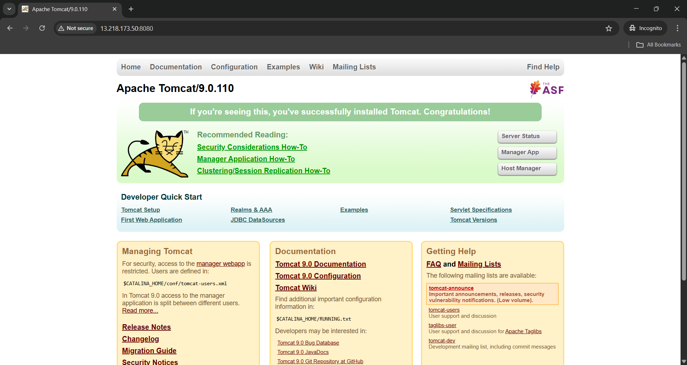

-----

# COPYING .WAR TO NEXUS REPO

> CONFIGURE pom.xml `vi pom.xml`


----

> The highlighted part in image describes about nexus tool 
>
> <id> is your nexus repo name 
>
> URL is the nexus repo URL


------

> change it with your repo URL and name


-----

> configure maven 
>
> `cd /etc/maven` and `sudo vi settings.xml`


------

> Now uncomment it and giive your username and password


-----

> After uncommenting it and giving username password you can see in below image


-----

> now clean `mvn clean` build `mvn build` and deploy to nexus tool repo using `mvn deploy`


-----

> now in your nexus tab you can see the version 0.0.1 .war


----

> Copy the URL to move .war file to /webapps in deploy server 


------

> For this `cd /webapps` and `wget <URL>` in that URL you need to give username:password@ of nexus after http://
>
> now your version 0.0.1 .war is copied into webapps folder 


-----

> you can view our version 0.0.1 in deploy server i.e Tomcat website

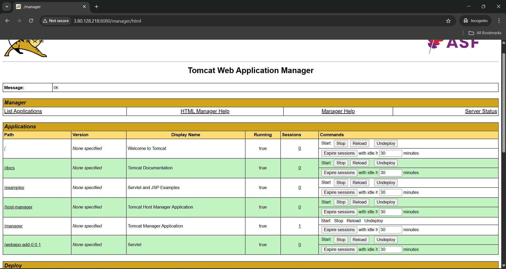

------

> test the output 

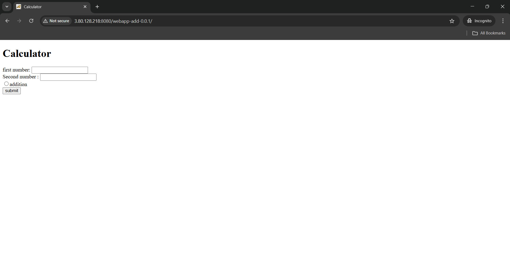

---

> Similarly follow the above steps when version 0.0.2 comes deploy it to nexus rebuild again`mvn deploy` 


----

> copy the path URL
>
> For this `cd /webapps` and `wget <URL>` in that URL you need to give username:password@ of nexus after http://
>
> now your version 0.0.2 .war is copied into webapps folder 


-----

> version 0.0.2 is deployed


----

> test the output


-----

> Follow the above steps and do the same when version 0.0.3 comes

> copy the path URL

> For this `cd /webapps` and `wget <URL>` in that URL you need to give username:password@ of nexus after http://

> now your version 0.0.2 .war is copied into webapps folder


----

> version 0.0.3 is deployed


----

> test the output


